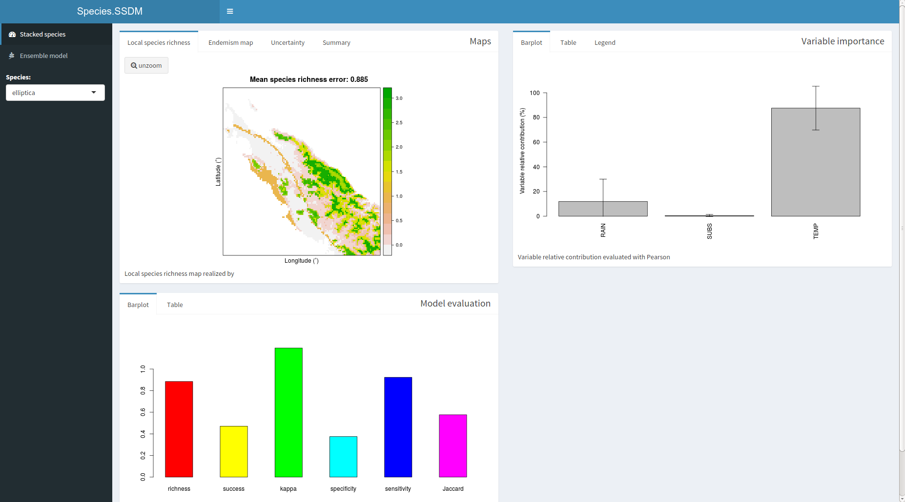

```{r setup, include=FALSE}
knitr::opts_chunk$set(echo = TRUE)
```


LightSSDM is a lighter implementation of SSDM package in R, written by Sylvain Schmitt et.al. (https://cran.r-project.org/package=SSDM), the purpose is to execute the creation of species distribution models (SDM) described in the article of the Schmitt SSDM package, besides bugs were corrected

Some algorithms were changed by others that process extensive data more efficiently in time and computer resources, in others some input data was changed so that processing is more efficient; The algorithms that handle the LightSSDM are: Generalized linear model (GLM), Generalized additive model for large datasets (BAM), Multivariate adaptive regression splines (MARS), Generalized boosted regressions model (GBM), Classification tree analysis (CTA), Random forest (RF), Maximum entropy (MAXENT), Artificial neural network (ANN), and Support vector machines (KSVM).

##  Installation


LightSSDM is not found in the official CRAN repository but can be installed from github using the "devtools" package.

```{r Instalar LightSSDM, eval = FALSE}
install.packages('devtools')

library(devtools)
install_github('hugocalcad/LightSSDM')
```

Once installed it is used in the same way as the SSDM package. Next we will see a basic summary.

## Input data

The input data are two; one the environmental variables (Env) that are the raster images that will help to create the models to later project them, another are the occurrences that are the presences-absences of the species, when we talk about species we only have presences and the package generates pseudoausencias for each algorithm and thus generate the model.

To load the data you have to do is first load the package 'LightSSDM', then there are two functions to process the input data: `load_var` to load and process the environmental variables (raster images) supports all the formats of the library` rgdal`, `load_occ` to load and process the occurrences that usually comes in` .csv` format. The instructions must be in that order since the environmental variables are needed to process the occurrences and are geographically correct.

```{r Entrada de datos, eval = FALSE}
library(LightSSDM)
Env <- load_var(system.file('extdata',  package = 'LightSSDM'), categorical = 'SUBSTRATE', verbose = FALSE, folder_tmp = "temporal_ENV")
Env
Occ <- load_occ(path = system.file('extdata',  package = 'LightSSDM'), Env,
         Xcol = 'LONGITUDE', Ycol = 'LATITUDE',
         file = 'Occurrences.csv', sep = ',', verbose = FALSE)
head(Occ)
```

The only difference with the original package is the variable `folder_tmp` that works when the variable` tmp` is true (`TRUE`), this does not overwrite data in the temporary folder if we have several variables (eg variables of the present and the future ).

##Species distributions model (SDMs)

To generate an SDM the `modeling` function is used as with the input data and the occurrences and selecting a single algorithm (GLM, BAM, GBM, MARS, CTA, RF, MAXNET, ANN, KSVM) as a result gives us an SDM already projected. Below is an example with the species * elliptica *.

```{r SDM, eval = FALSE}
SDM <- modelling('GLM', subset(Occurrences, Occurrences$SPECIES == 'elliptica'), 
                 Env, Xcol = 'LONGITUDE', Ycol = 'LATITUDE', verbose = TRUE)
plot(SDM@projection, main = 'SDM\nfor Cryptocarya elliptica\nwith GLM algorithm')
```

## Ensebls species ditribution modelos (ESDM en ingles)

To generate an ESDM the `ensemble_modelling` function is used, just as the` modeling` function requires the environmental variables and the occurrences, but with the difference that you can choose several algorithms, which in the end will be assembled. In the example we continue using the same species * elliptica *.

```{r ESDM, eval = FALSE}
ESDM <- ensemble_modelling(c('CTA', 'MARS'), subset(Occurrences, Occurrences$SPECIES == 'elliptica'),  Env, rep = 1, Xcol = 'LONGITUDE', Ycol = 'LATITUDE',                ensemble.thresh = c(0.6), verbose = TRUE)
plot(ESDM@projection, main = 'ESDM\nfor Cryptocarya elliptica\nwith CTA and MARS algorithms')
```

## Stacking species distribution model (SSDM)

To generate SSDM you have the function `stacking_modelling` use the same parameters as ensemble that` ensemble_modeling`, the difference is the result, the stack is a stack of SDMs or ESDMs. In the example we continue using the same species * elliptica *.

## Outputs

The models generated basically are:

*Evaluation of model accuracy*, statistical metrics that measure how accurate the model is, are included in the `SDMtools` package, these include (ROC - operation characteristic area, AUC - area under the curve, Kappa - coefficient of cohen, omission rate , specificity (true negative rate), sensivity  (true positive rate)). These metrics are carried to a confusion matrix, which is taken to the biannier map of presences / absences. Below are the values for both assembled and stacked models.

```{r SDM evaluation, eval = FALSE}
knitr::kable(ESDM@evaluation)
```

```{r SSDM evaluation, eval = FALSE}
knitr::kable(SSDM@evaluation)
```

*Analysis of importance of environmental variables*, the package performs an analysis to determine how important a variable is to generate the model, the baseline is basically a table that shows a ranking of importance of environmental variables. In the example it is shown for the SSDM.

```{r SSDM variable importance, eval = FALSE}
knitr::kable(SSDM@variable.importance)
```

*Endemic map* Refers to the fact that the species are unique to the defined geographical location. Endemic species maps can be calculated using two metrics:

1. The Weighted Endemism Index (WEI)
2. The corrected weighted endemism index.

```{r SSDM endemism, eval = FALSE}
plot(SSDM@endemism.map, main = 'Endemism map\nfor Cryptocarya genus\nwith CTA and SVM algorithms')
```


*Summary* all results are displayed using the `plot` function that generates a new window using` shiny` package functions, in addition this function can also show a model of a single algorithm, showing the species richness map, the binary map of absence/presence of a species and the other tables, as shown in the following code and output:

```{r plot, eval = FALSE}
# plot(SSDM)
```

{width=100%}
