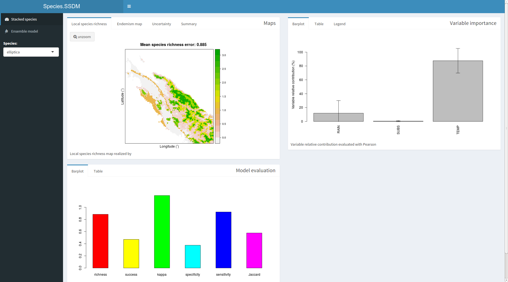

```{r setup, include=FALSE}
knitr::opts_chunk$set(echo = TRUE)
```

LightSSDM es una implementación más ligera del paquete SSDM de R escrito por Sylvain Schmitt et.al. (https://cran.r-project.org/package=SSDM), el propósito es realizar modelos de distribución de especies (SDM - species distribution model) descritos en el artículo del paquete SSDM (http://doi.wiley.com/10.1111/2041-210X.12841) de Schmitt, pero acelerando el tiempo de ejecución y uso de recursos. Además se corrigieron algunos bugs encontrados.

Se cambiarón algunos algoritmos por otros que procesan datos extensos (large dataset) de manera más eficiente en tiempo y recursos del ordenador, en otros se cambiaron algunos datos de entrada para que sea más eficiente en su procesamiento; los algoritmos que manejan el LightSSDM son: Generalized linear model (GLM), Generalized additive model para datos grandes (BAM), Multivariate adaptive regression splines (MARS), Generalized boosted regressions model (GBM), Classification tree analysis (CTA), Random forest (RF), Maximum entropy (MAXENT), Artificial neural network (ANN), y Support vector machines (KSVM).

##  Instalación

LightSSDM no se encuentra en el repositorio oficial de CRAN pero se puede instalar desde github utilizando el paquete "devtools".

```{r Instalar LightSSDM, eval = FALSE}
install.packages('devtools')

library(devtools)
install_github('hugocalcad/LightSSDM')
```

Una vez instalado se lo utiliza de la misma manera que el paquete SSDM. A continuación veremos un resumen básico.

## Datos de Entrada

Los datos de entrada son dos; 1) las variables ambientales (Env) que son las imagenes ráster que ayudaran a crear los modelos para posteriormente proyectarlos, 2) las ocurrencias que son las presencias-ausencias de las especies, cuando se habla de especies solamente se tiene presencias y el paquete genera pseudoausencias para cada lagoritmo y así generar el modelo.

Para cargar los datos se tiene hacer primeramente es cargar el paquete `LightSSDM`, luego existen dos funciones para procesar los datos de entrada: `load_var` para cargar y procesar las variables ambientales (imagenes ráster) soporta todos los formatos de la libreria `rgdal`, `load_occ` para cargar y procesar las ocurrencias que generalmente viene en format `.csv`. Las intrucciones deben ir en ese orden ya que se necesitan las variables ambientales para procesar las ocurrencias y esten geográficamente correctas.

```{r Entrada de datos, eval = FALSE}
library(LightSSDM)
Env <- load_var(system.file('extdata',  package = 'LightSSDM'), 
                categorical = 'SUBSTRATE', verbose = FALSE, 
                folder_tmp = "temporal_ENV")
Env
Occ <- load_occ(path = system.file('extdata',  package = 'LightSSDM'), Env,
         Xcol = 'LONGITUDE', Ycol = 'LATITUDE',
         file = 'Occurrences.csv', sep = ',', verbose = FALSE)
head(Occ)
```

La únca diferencia con el paquete original es la variable `folder_tmp` que funciona cuando la variable `tmp` es verdadero (`TRUE`), esto para no sobreescribir datos en la carpeta temporal si tenemos varias grupos variables ambientales (e. g. variables del presente y del futuro).

##Modelos de distribución de especies (SDMs en ingles)

Para generar un SDM se utiliza la funcion `modelling` que con los datos de entrada y las ocurrencias y seleccionando un único algoritmo (GLM, BAM, GBM, MARS, CTA, RF, MAXNET, ANN, KSVM) como resultado nos da un SDM ya proyectado. A continuación se muestra un ejemplo con la especie *elliptica*.

```{r SDM, eval = FALSE}
SDM <- modelling('GLM', subset(Occurrences, Occurrences$SPECIES == 'elliptica'), 
                 Env, Xcol = 'LONGITUDE', Ycol = 'LATITUDE', verbose = TRUE)
plot(SDM@projection, main = 'SDM\nfor Cryptocarya elliptica\nwith GLM algorithm')
```

## Modelos de distribución de especies ensamblado (ESDM en ingles)

Para generar un ESDM se utiliza la función `ensemble_modelling`, al igual que la funcion `modelling` se necesita las variables ambientales y las ocurrencias, pero que con la diferencia que se puede escoger varios algoritmos, que al final seran ensamblado. En el ejemplo se continua utilizando la misma especie *elliptica*.

```{r ESDM, eval = FALSE}
ESDM <- ensemble_modelling(c('CTA', 'MARS'), 
                           subset(Occurrences, Occurrences$SPECIES == 'elliptica'), 
                           Env, rep = 1, Xcol = 'LONGITUDE', Ycol = 'LATITUDE',      
                           ensemble.thresh = c(0.6), verbose = TRUE)
plot(ESDM@projection, main = 'ESDM\nfor Cryptocarya elliptica\nwith CTA and MARS algorithms')
```

## Apilado de modelos de distribucion de especies (SSDM en ingles)

Para generar SSDM se tiene la función `stacking_modelling` utiliza los mismos parámetros que ensemble que `ensemble_modeling`, la diferencia es el resultado, el apilado es un stack de SDMs o ESDMs. En el ejemplo se continua utilizando la misma especie *elliptica*.

```{r SSDM, eval=FALSE}
SSDM <- stack_modelling(c('CTA', 'KSVM'), Occurrences, Env, 
                       rep = 1, ensemble.thresh = 0, Xcol = 'LONGITUDE', 
                       Ycol = 'LATITUDE', Spcol = 'SPECIES', method = "pSSDM",
                       verbose = TRUE)
plot(SSDM@diversity.map, main = 'SSDM\nfor Cryptocarya genus\nwith CTA 
     and KSVM algorithms')
```

Toda la documentación de las funciones con mas detalle se puede ver en la ayuda que genera automaticamente el R para este caso se puede usar `?stack_modelling`.

## Salida o Resultados

Los modelos generados basicamente son: 

*Evaluación de la precisión del modelo*, son metricas estadísticos que miden cuan preciso es el modelo, estan incluido en el paquete `SDMtools`, estos incluyen (ROC - área caracteristica de operación, AUC - área bajo la curva, Kappa - coeficiente de cohen, omissión rate - tasa de omición, specificity - especificidad(tasa negativa verdadera), sensivity - sensibilidad (tasa positiva verdadera)). Estas métricas se llevan a una matriz de confusión, el cual es llevado al mapa bianrio de presencias/ausencias. A continuacion se muestran las envaluaciones tanto para los modelos ensamblados y los apilados.

```{r SDM evaluation, eval = FALSE}
knitr::kable(ESDM@evaluation)
```

```{r SSDM evaluation, eval = FALSE}
knitr::kable(SSDM@evaluation)
```

*Anáisis de importancia de las variables ambientales*, el paquete realiza un análisis para determinar cuan importante es una variable para generar el modelo, la sálida basicamente es una tabla que muestra un ranking de importancia de las variables ambientales. En el ejemplo se muestra para el SSDM.

```{r SSDM variable importance, eval = FALSE}
knitr::kable(SSDM@variable.importance)
```

*Mapa de endemismo* Se refiere a que las especies son exclusivas de la ubicación geográfica definida. Los mapas de endemismo de especies se pueden calcular utilizando dos métricas:

1. El índice de endemismo ponderado (WEI)
2. El índice de endemismo ponderado corregido.

```{r SSDM endemism, eval = FALSE}
plot(SSDM@endemism.map, main = 'Endemism map\nfor Cryptocarya 
     genus\nwith CTA and KSVM algorithms')
```

*Resumen* todos los resultados son deplegados utilizando la función `plot` que genera una nueva ventana utilizando funciones del paquete `shiny`, además esta función también puede mostrar de un modelo de un solo algoritmo, mostrando el mapa de riqueza de especies, el mapa binario de ausencia/presencia de una especiey las demas tablas, como se muestra en figura 1.

```{r plot, eval = FALSE}
# plot(SSDM)
```

{width=80%}
